***

# Notes 10-9-23

## Week 2 of Course 2

## Mini Batch Gradient Descent

* Previously, we would take one step of **gradient descent** per **epoch** or pass through the training set.

* This is however, extremely inefficient if the training set was very large, say 5m examples.

* Thus, it makes sense to break the training set into smaller batches of say 1k examples, i.e. 5k batches.

* This means for one epoch, we take 5k steps of **gradient descent**.

* Then, we iterate over the 5k batches again and again.

* This allows us to converge much faster.

* Size of the mini batch is an important **hyperparameter** and usually intermediate values, between 1 and the number of examples, work well.

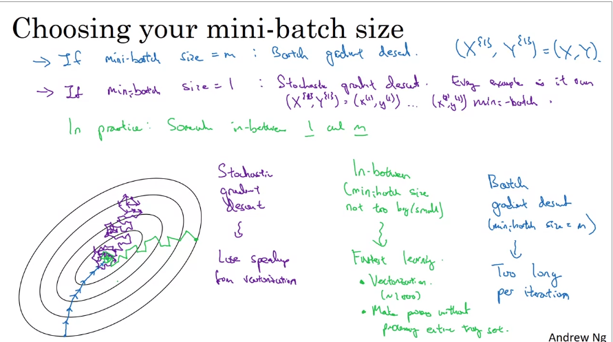

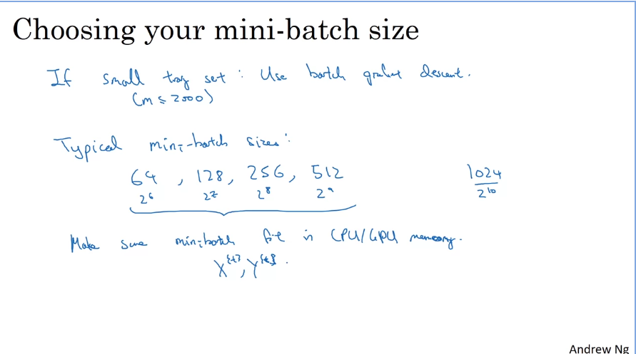

***
## Exponentially Weighted Averages

* **Exponentially weighted** averages, also known as moving averages, are computed using the following formula:

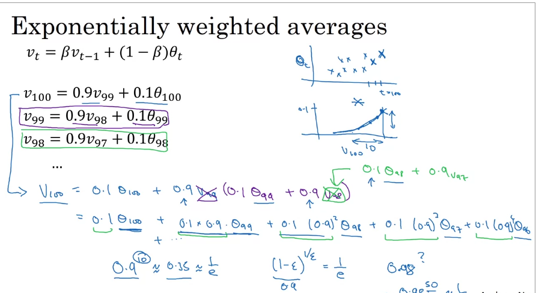

* During the initial phases, **ExpWeightAvgs** shows much lower values than the actual observed values.

* To correct this, ****bias correction** is performed as follows:

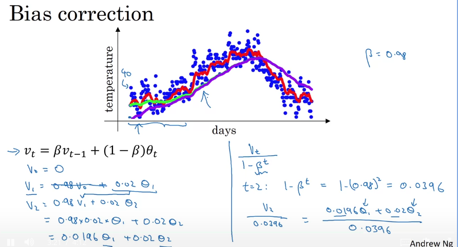

* The term 1 - beta ^ t is small for initial values of t, but for larger values of t, it approaches unity, and thus the denominator has no effect.

***
## Optimisation Algorithms

* Vanilla **gradient descent** can be modified to yield better results.

* This gives rise to different optimisation algorithms as:

    1. Momentum 
    2. RMSprop
    3. ADAM

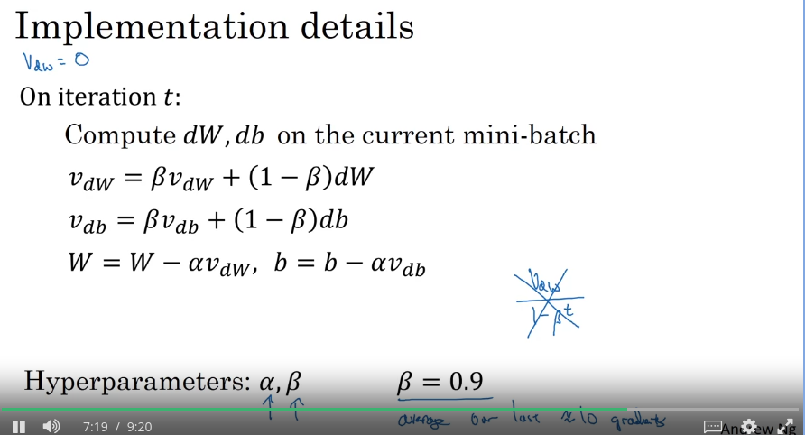

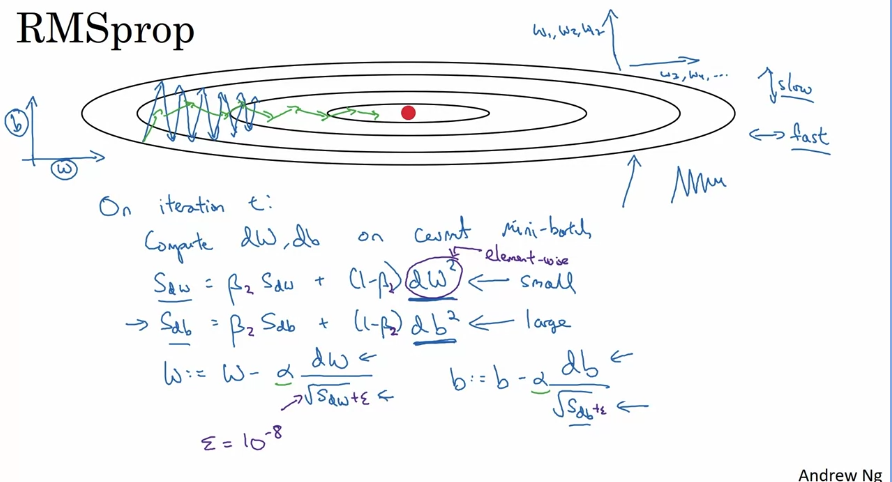

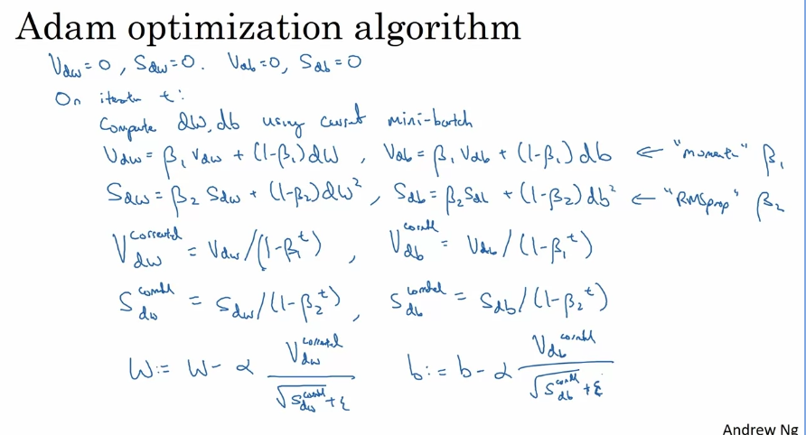

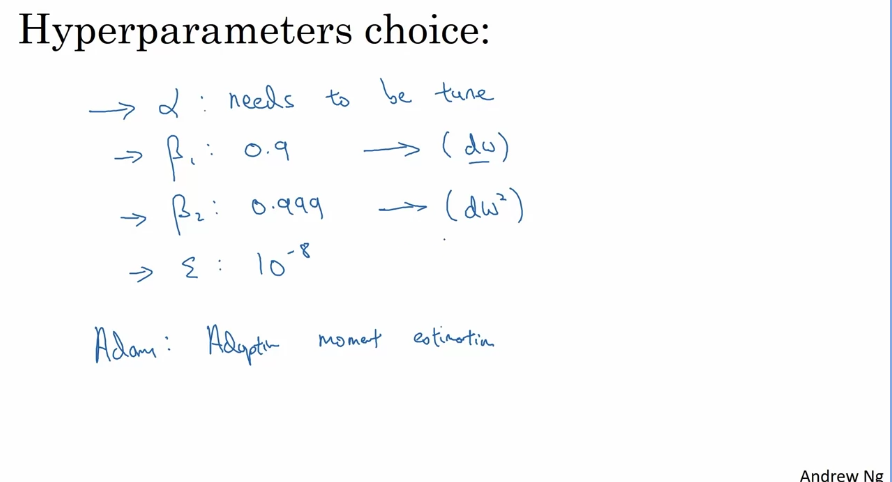

***
## Learning Rate Decay

* Slowly reducing the **learning rate** over time helps speed up the learning algorithm and converge faster.

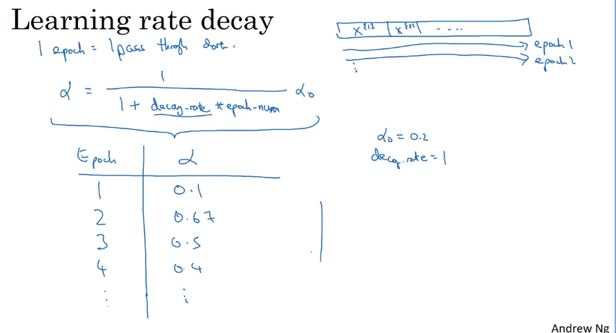

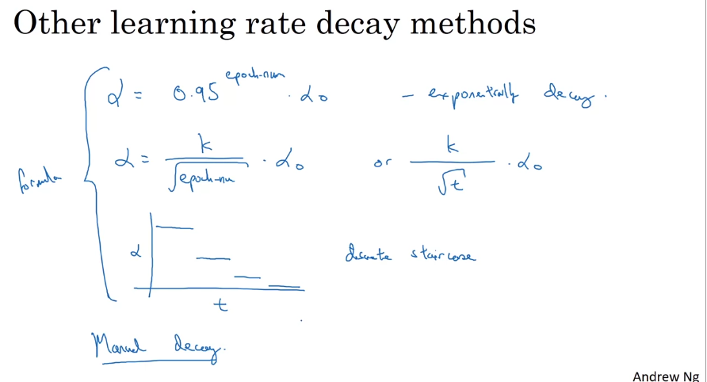

***
## Problems of local optima

* **Local optima** is a point at which the gradient is zero, but the cost is not minimum.

* However, **local optima** are much less common in high dimensional nerual networks.

* **Saddle points** are more likely to exist than local optima.

* The actual problem are **plateaus**, regions where the gradient is near zero for a long period.

* The algorithm spends too much time trying to escape the **plateau**.

* This is where something like the **ADAM learning algorithm** comes in handy.

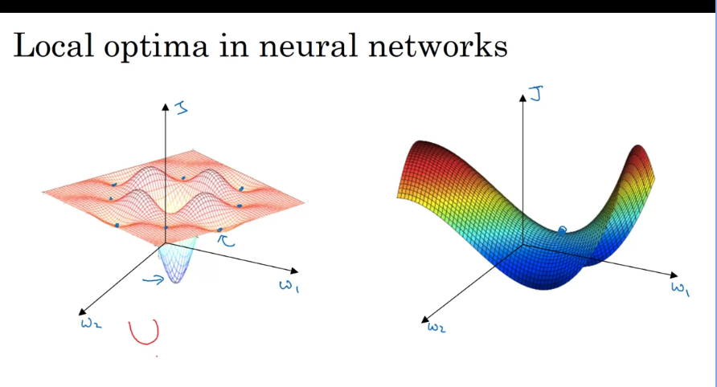

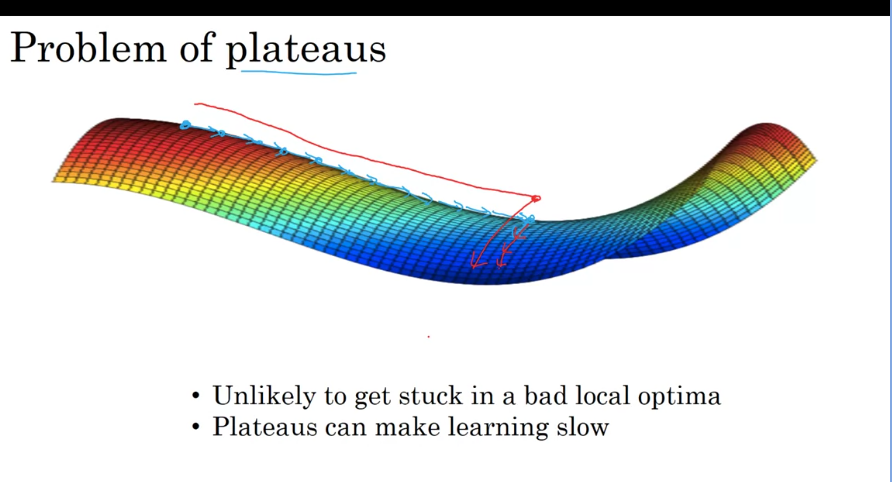