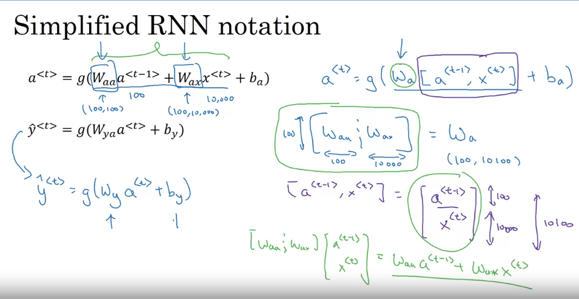
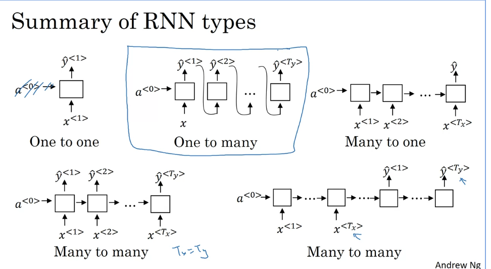
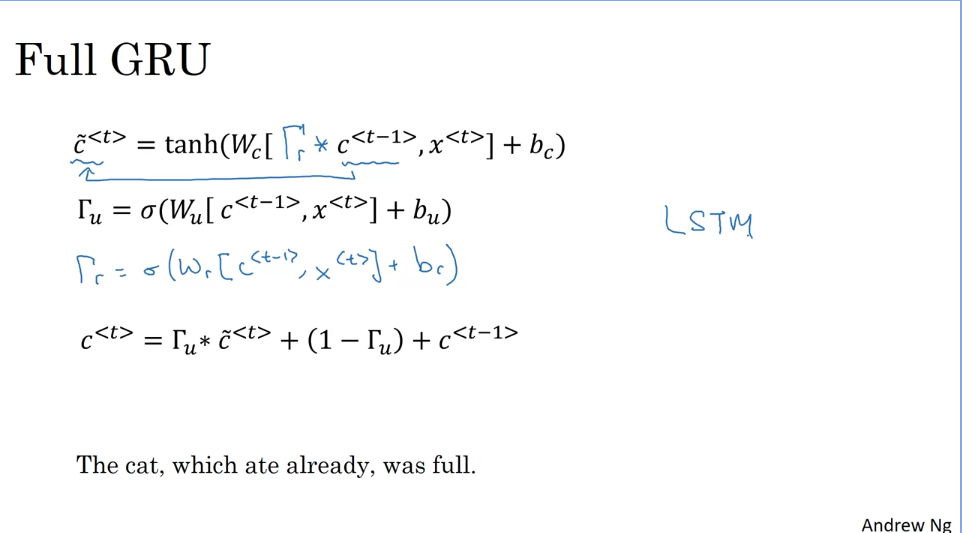
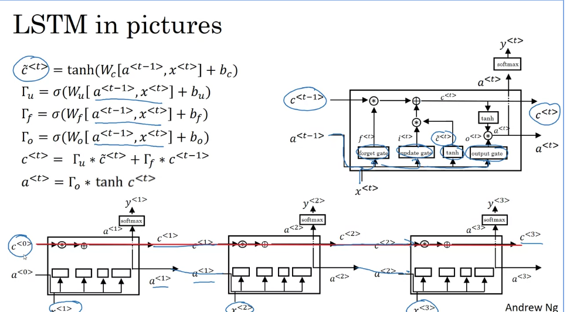
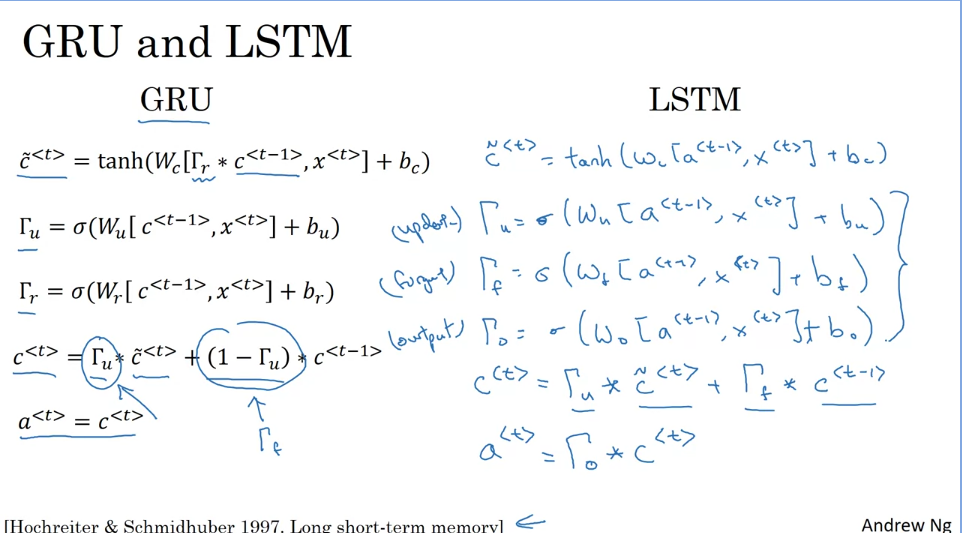
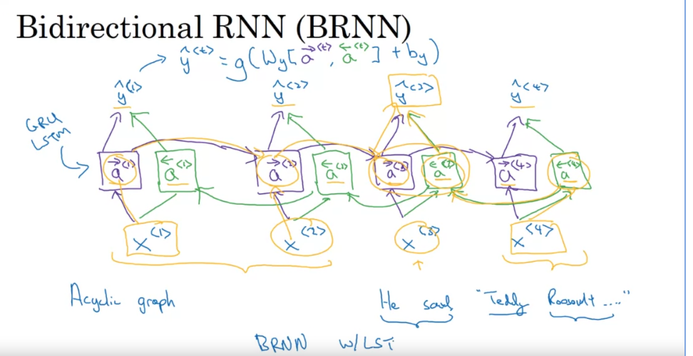
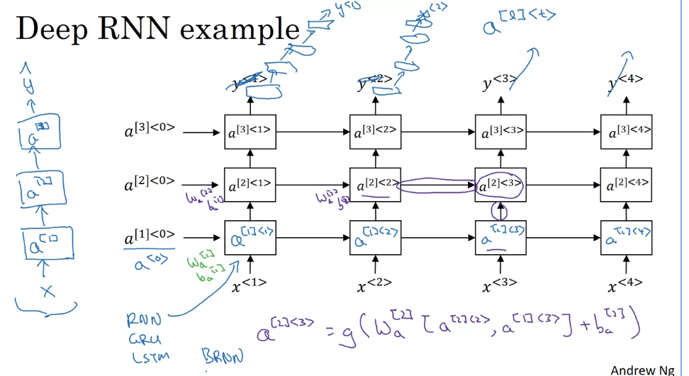

# Notes 17-9-23

## Week 1 of Course 5

## Recurrent Neural Networks (RNNs)

* **Conventional Deep NNs** are unable to process input and output sequences of varying length.

* They are also unable to learn **positional dependencies** between elements of an input sequence.

* This is where **RNNs** are useful, as they are able to overcome this problem.

* **RNNs** are a type of **NN** where the output of the previous step is fed into the next step.

* This output is called the **hidden state** and represents the memory of the model.

* At each time step, the output of the cell is a function of the **activation** of the previous step, the input at the current step along side the weights.

* The equations governing the forward pass of an **RNN model** are given as :

* Note that the **weights** used in each time step are the **same**, i.e., the model reuses the same cell over and over again.

* **Backpropagation in RNNs** is carried out similar to a **Deep NN**, however, the cost function is now a **sum of the costs** of each time step.

* This **total cost** over all time steps is minimized through **gradient descent**.

* There are many types of **RNNs** as shown below :

* But, **RNN backpropagation** also suffers from **exploding gradients** problem.

* This can be thought of as the model not having **long term memory** and forgetting earlier elements of the sequence.

* One way to prevent this is by **gradient clipping**, which forcefull restricts the gradients to a certain range of values.

***
## Gated Recurrent Units (GRUs)

* **GRUs** are a type of **RNN**, that use **gating mechanisms** to selectively update the **hidden state**.

* **GRUs** make use of an **update** gate and a **reset** gate.

* The **reset** gate decides how much of the previous **hidden state** to keep, and the **update** gate decides how much of the new input to incorporate into the **hidden state**.

* The **hidden state** also acts as the **cell state** and the **output**, so there is no separate **output** gate.

***
## Long Short Term Memory (LSTMs)

* **LSTMs** are a variant of **RNN**, designed to overcome the shortcomings of **RNNs**.

* Each memory cell has three gates: an **input** gate, an **output** gate, and a **forget** gate.

* The **input** gate decides what information to add to the **cell state**.

* The **output** gate decides what information to output from the **cell state**.

* The **forget** gate decides what information to discard from the **cell state**.

* Equations governing an **LSTM** are given as :

* **LSTMs** are essentially a more generalised version of **GRUs**.

* **LSTMs** see more usage than **GRUs**.

***
## GRUs v/s LSTMs

## Bidirectional Recurrent Neural Networks (BRNNs)

* **BRNNs** are a special type of **RNN**, that can process input sequence in **both** forward and backward directions.

* This allows the network to learn from **both** past and future context.

* **BRNNs** see good usage in **NLP** tasks such as sentiment analysis, speech recognition, etc.

## Deep RNNs

* It is possible to construct **Deep Recurrent Neural Networks**, by passing the output of one **time step**, as input to the **same time step** of a different **RNN** cell.

* This is better illustrated in the figure below.

***