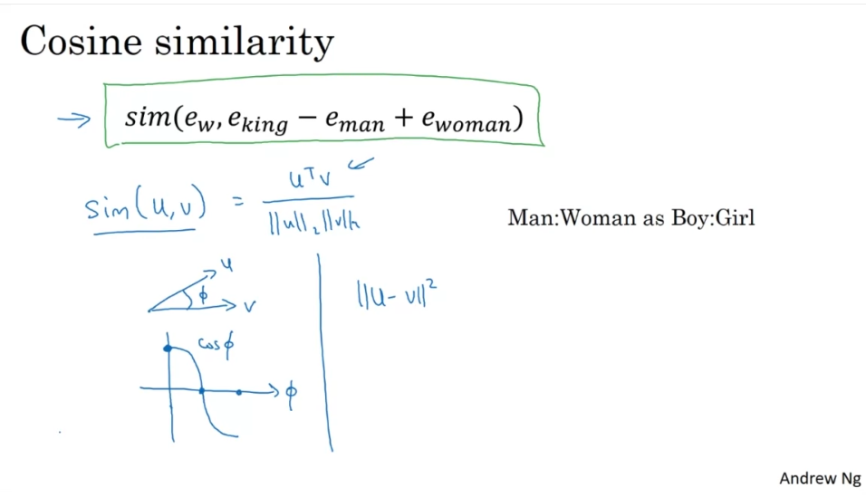
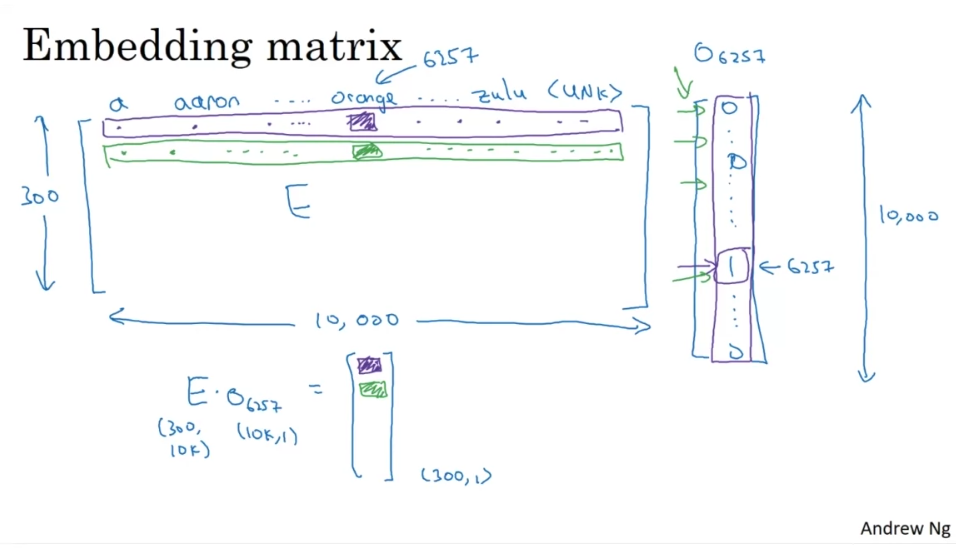
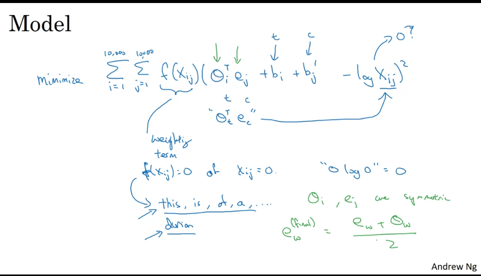

# Notes 20-9-23

## Word Embeddings

* **Word embeddings** are a way to represent words using numbers.

* A machine learning model cannot directly understand the meaning associated with a particular word.

* **Word embeddings** however are a _64/128/256/512_ etc dimensional vector of features relating to that word.

* **Word embeddings** however require a very large **corpus** of text to be able to learn properly.

* **Word embeddings** really excel when our training data set is small.

* In this scenario, we can use pretrained **Word embeddings** from online so that our model gets a headstart on the meanings of words in our vocabulary.

* **t-SNE** is a very complicated algorithm that maps n-dimensional **Word embeddings** onto a 2D plane.

* It shows us how words having similar meanings, similar spellings, similar realtions to other words are often **grouped together**, while words having no relation to each other are **far apart**.

* One way to evaluate the similarity between two **Word embeddings** is through the **cosine similarity** which is given as follows : 
  

* You can also use **euclidean distance**, but cosine similarity is far more common and useful.

* In this way **Word embeddings** can learn relations between words, such as Boy:Man as Girl:Woman, etc.
  
* By far, the most common way of using **Word embeddings** is through an **embedding matrix** that stores the embeddings for all words in the vocabulary.

* Then, we multiply this **embedding matrix** by a **one hot vector** of the same size as our vocabulary to extract that particular word's **embedding vector**.

***
## Word2Vec

* **Word2Vec** is an algorithm for learning **Word embeddings** from a large corpus of text.

* There are two forms of **Word2Vec, skipgram and bag of words**.

* In the **skipgram model**, the model tries to predict the **context**(neighbours) of a given **target** word.

* We also provide **negative samples**, or pairs of **context and target** that are wrong(irrelevant) to show the model that these words arent related.

* This together with the positive samples, helps the model grasp the true meanings of words and the context associated with them.

## GloVe Word Vectors

* **GloVe** is another model for learning **Word embeddings** that works differently from **Word2Vec**.

* **GloVe** starts by measuring how many time a word i occurs in the context of a word j.

* It then tries to minimize the following formula.

* The key difference between **GloVe and Word2Vec** is that while **Word2Vec** gets its embeddings from words being used in similar contexts, **GloVe** gets its embeddings from statistics, i.e. words being used next to each other over and over again.

* In general, however **Word2Vec** is a more efficient algorithm for learning **Word embeddings**.