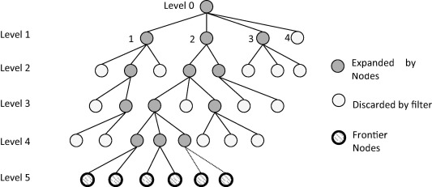
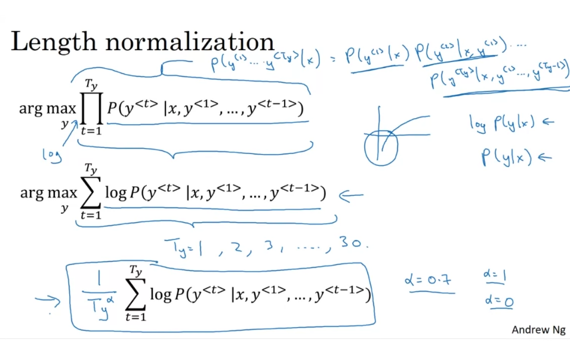
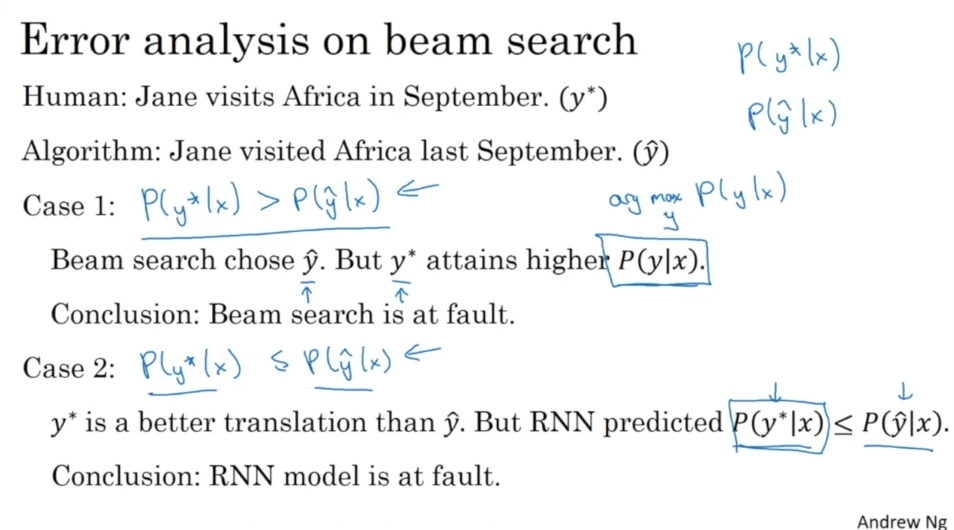
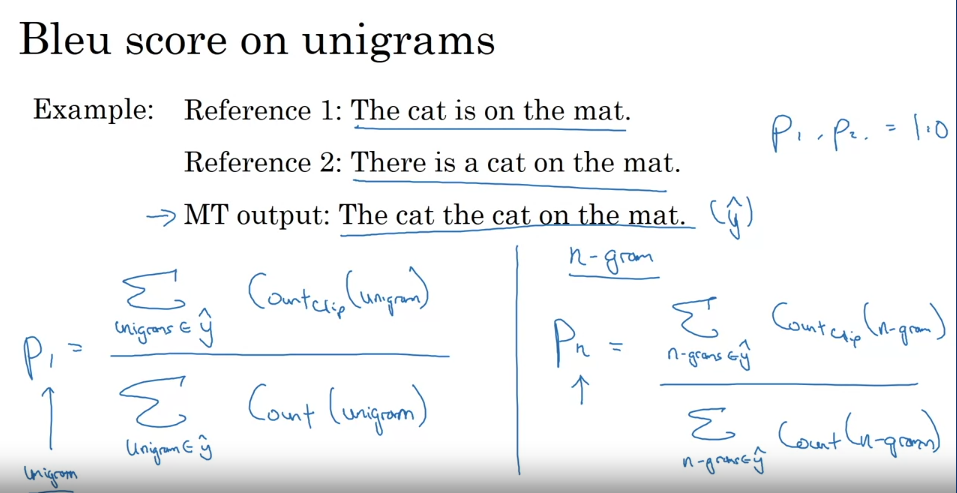
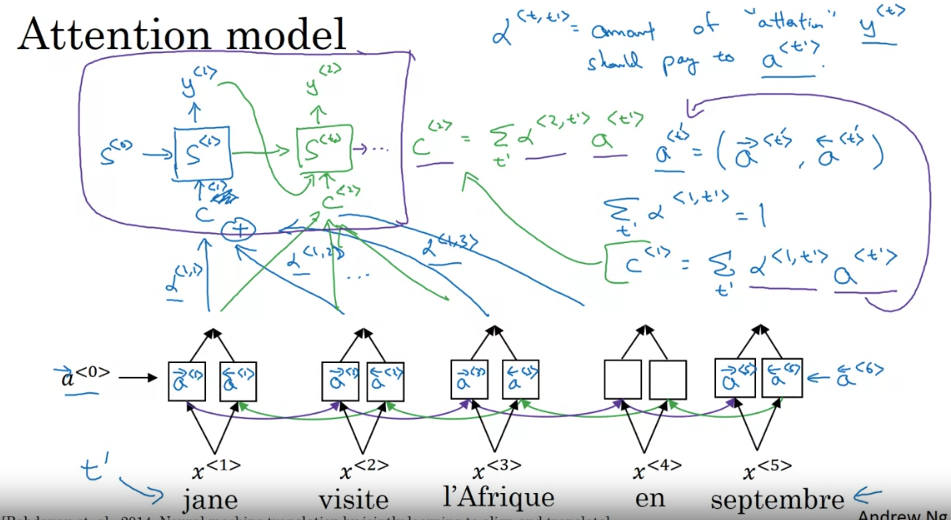
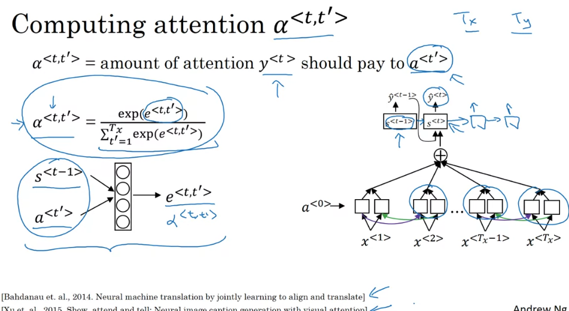

# Notes 22-9-23

## Week 3 of Course 5

## Beam Search

* Typical machine translation models have an architecture called a **conditional language model**.

* It selects the output based of the current time step based on the inputs that came before it and the outputs that were produced before it(if any).

* But the outputs are selected on the basis of the **softmax probability**, preferably not at random, but instead an argmax.

* So if you follow **greedy search**, which just follows one output to the next, only looking at the **highest probability**, you may not reach an optimal solution.

* Instead it helps to look at a beam or the top three most likely outputs and follow those through, at each subsequent step selecting the most likely three candidates of the three branches. 

* **Beam search** is better illustrated by the following tree : 

* **Beam Search** is only an **approximate** technique and is not guaranteed to find the optimal solution, but it can get pretty close to it in practice with ease.

* It does however require you to instantiate **three copies** of the model.

* We can carry out certain modifications to **Beam Search** inorder to improve it.

* In reality, **Beam Search** is simply trying to **maximize** the product of probabilities as shown : 

* Thus, **shorter** translations, although not as accurate may be given a higher probability than **longer** ones.

* In order to prevent this, we divide by the **length of the output sequence**, raised to some _alpha_ between 0 to 1.

* This ensures that **longer sentences arent penalised** simply for being longer, despite their correctness.

* In general, a smaller beam width runs **faster**, but is less likely to find the most **optimal solution**, and vice versa.

* If our model is not generating the right output, how are we supposed to know whether its the **RNN** or the **Beam Search** thats the problem?

***
## BLEU score

* In the case of **machine translation**, it is possible that not one, but a group of 3-7 translations all fit the input sentence correctly.

* If you designate only one of these as correctly labelled, you would **penalise** the model even for predicting correctly.

* If you designate all of them as correctly labelled you would be exponentially increasing the compute required.

* The solution lies in changing the way **we score** the models peformance.

* BLEU stands for **Bilingual Evaluation Understudy**.

* Bleu measures how often words in the predicted sequence occur in the labelled sequence.

* It does so using this formula : 

* The resulting output is a number between 0 and 1 that tells you how well the **predicted** output is compared to the **correct** output.

***
## Attention Model

* For **longer sequences**, even **LSTMs / GRUs fail** to remember the earlier input tokens properly and thus it becomes hard to relate the earlier parts of the **input sequence** to what comes later.

* To overcome this, we separately compute the **attention score** of each token in the input sequence relative to other tokens as illustrated below : 

* These **attention scores** are then passed to a **LSTM / GRU** which computes the next predicted token using the **attention scores**, to decide which tokens matter more for the current input token.

* **Attention scores** are computed as follows : 

