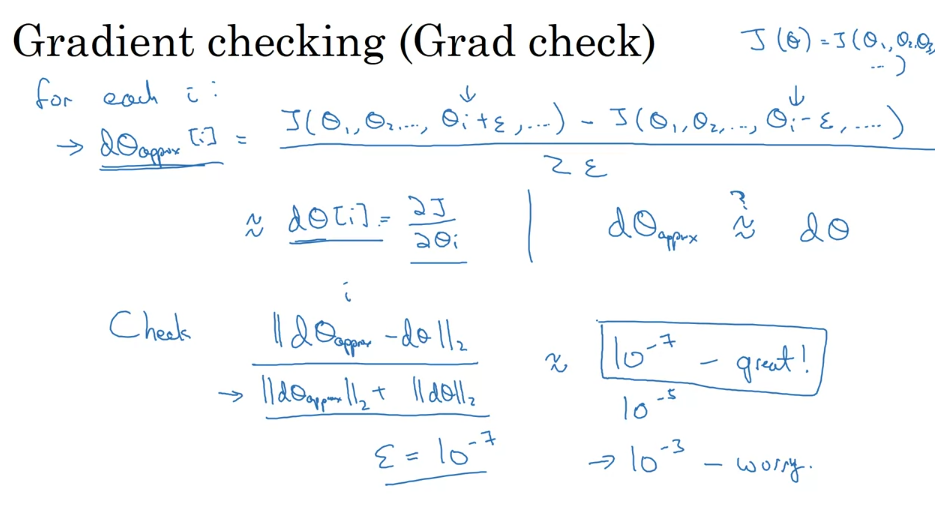

# Notes 9-9-23

## Week 1 of Course 2

* It is impossible to correctly guess the best hyperparameters when working on a model.

* Datasets are usually divided into **train/dev/test** sets.

* The **train** set is used for training various algorithms.

* The **dev** set is used to cross-validate which algorithm works best.

* Finally, the **test** set is used to get an unbiased estimate of how well the final selected model is doing.

* In modern datasets, comprisining of over **millions** of examples, the **dev** and **test** sets are usually a small percentage of the entire dataset.

* Another possible problem with datasets that may arise, is the **mismatched train/test distribution**, which is when your **train** and **dev/test** sets come from different distributions.

* One way to visualise this is to imagine a model trying to recognise cat pictures uploaded by users(low res), but the model is trained on cat pictures taken by professional photographers(high res).

* Sometimes, if you dont need an unbiased measure of how well your algorithm is perfoming, its okay to not have a test set.

* The **bias** and **variance** of a model are two types of errors associated with the model.

* **Bias** is commonly associated with the error in the training dataset. 

* Higher the train data set eror, higher the **bias**.

* On the other hand, **variance** is commonly associated with the error in dev dataset.

* More the difference between train error and dev error, more is the **variance**.

* Both are undesirable to have in large proportions, and good models will have low **bias** and **variance**.

* High **bias** leads to the problem of **underfitting**.
  
* While high **variance** leads to the problem of **overfitting**.

* Note that the train and dev errors are measured relative to the **human error**, or **optimal bayes error**. 

* That is, if the **optimal bayes error** itself is around 15%, then actual train dataset error of 18% isn't too bad.

 

* There is an algorithm or recipe that we can follow to solve the problem of high bias and high variance.

* High **bias** can be solved by:

    1. Using a bigger network.

    2. Training for longer periods.

    3. Using a different NN architecture.

* High **variance** can be solved by:

    1. Using more data.

    2. Regularisation.

    3. Using a different NN architecture.

* The **Bias/Variance Tradeoff** is a concept that shows how reducing the **bias** can increase the **variance** or vice-versa.

* This was a major problem earlier, but in the modern era, we have newer techniques that reduce one without affecting the other.

* **Regularisation** is a way to reduce the **variance** of an algorithm.

* Popular **Regularisation** techniques include:

    1. L1 Regularisation

    2. L2 Regularisation

* **L1 Regularisation** is not used too much in practice as compared to **L2 Regularisation** due to its sparse output(too many zero weights).

* **L1 and L2 Regularisation** are implemented using the following equations:

* The extra term added to the cost function penalises the weight matrices for being too large.

* The F subscript denotes the **Frobenius Norm** of the matrix.

## How does Regularisation prevent overfitting (high variance) ?

* In essence, if the **regularisation parameter lambda** is increased, the cost function is penalised for larger weights, leading to smaller values of the weight matrices.

* For smaller values of _w_, the value of _z_ computed will also be smaller.

* Finally, for smaller _z_, the activation function (say **tanh**) exhibits linear behaviour as shown in the figure.

* Thus the neural network ends up computing more linear functions, which have less capability to **overfit**.

* Another type of regularisation commonly used is **Dropout Regularisation**.

* In this method, randomn units of the neural network are zeroed out, that is, have their activation functions set to zero.

* This allows smaller portions of the network to be trained on that particular example.

* **Inverted Dropout** is done by scaling the final activation functions by dividing with the probability threshold used to zero the layer.

* This ensures that the effective value of _z_ remains unchanged by the dropout regularisation.

* Note that at test time, dropout regularisation is not performed, the entire network is used to evaluate the test data.

* One downside of **Dropout Regularisataion** is that the cost function is no longer well defined for each iteration.

## Few other techniques to reduce overfitting
***
### 1. Data Augmentation
* Lets say you have a model that recognises cat photos.

* If additional data is expensive or not available, then you can augment the existing data, by say, laterally inverting the image, zooming and cropping the image, introducing random distortions, etc.

* This does not work as well as fresh data would, but it does work, and can teach your model that any cat image inverted laterally is still a cat image.

***
### 2. Early Stopping

* **Early Stopping** refers to stopping training earlier, at the point where error of dev set is minimum.

* Because we stop at earlier iterations, the values of weights are also smaller, closer to the small values we initialised with.

* However, the major disadvantage of this, is that the cost function is not fully optimised as we stop training early.
***
## Normalizing Input

* **Normalizing** the input consists of two major steps:

    1. Zero-ing the mean
    2. Making variance unity

* This is done as follows:

***
## Why Normalize?

* Normalizing the input makes it much easier to train the model.

* The cost function for normalized data is much more symmetric.

* The weights of input features trained using normalized data also have ratios closer to unity.
***
## Exploding/Vanishing Gradients

* One other problem with very deep networks, is that if the **weights are larger than unity or smaller than unity**, then the output values goes on **increasing/decreasing exponentially**.

* Similar to the activations, gradients too will **increase/decrease exponentially**.

* This makes it very hard to train, as if the gradients explode, then gradient descent would **diverge**.

* On the other hand, if the gradients vanish, it would take exponentially more steps to **converge**.

* One partial solution to the **vanishing/exploding** gradient problem is to set the **variance of intialized weight matrices for a layer, close to unity**.

* This is done differently for different activation functions as shown:

***
## Gradient checking and why is it needed?

* For **n-layer** models, the **backpropagation** step is extremely complicated in implementation.

* For this purpose its helpful to check the values of gradients computed by the backprop step against our own **approximations** of it.

* If the difference between the two is negligible, then we know our backpropagation works fine!

* This is done with the help of following equations:

***
## For any implementation related notes, refer the assignments