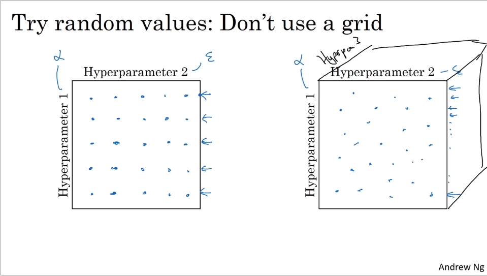
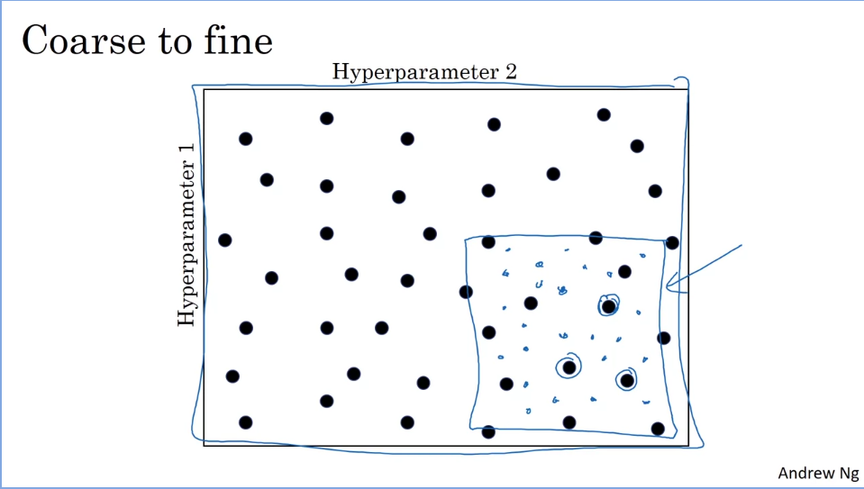
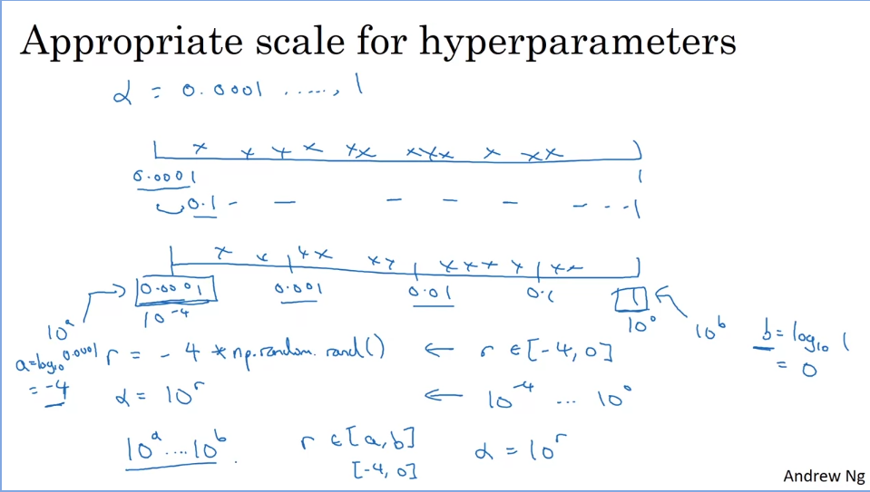
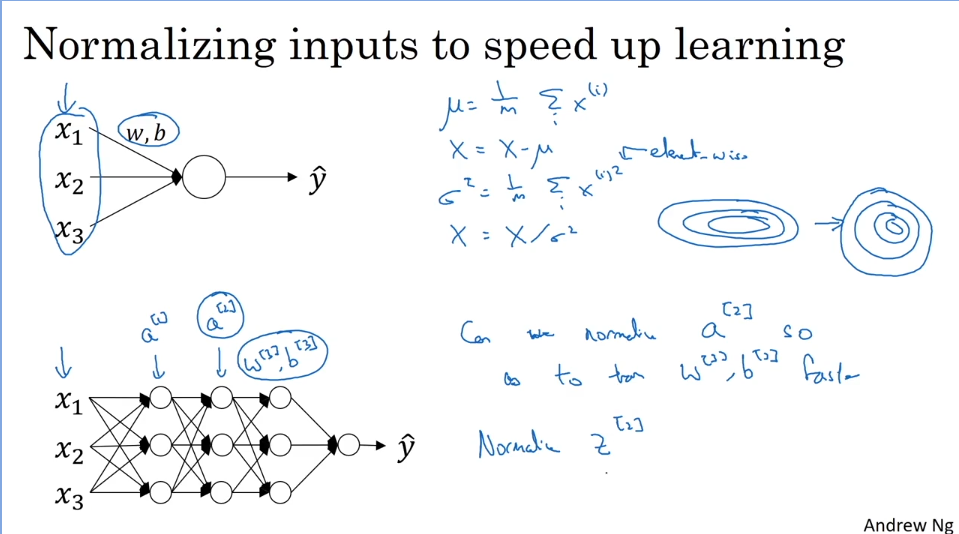
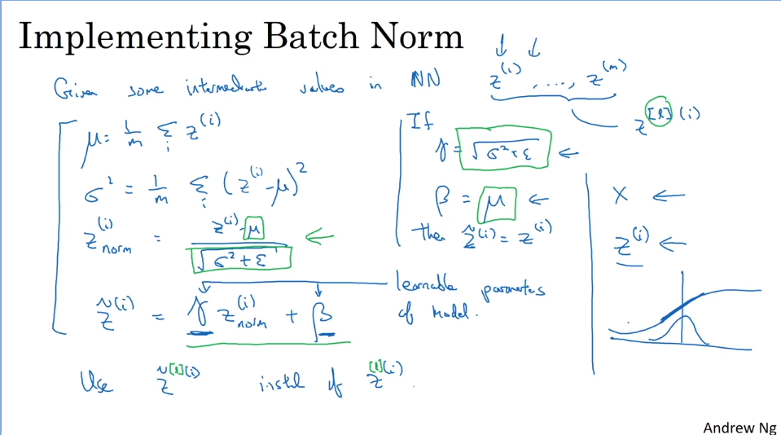
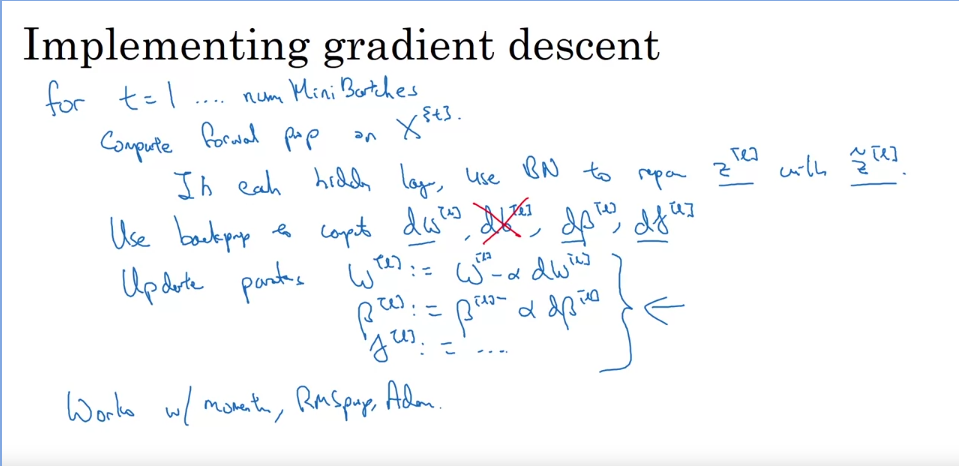
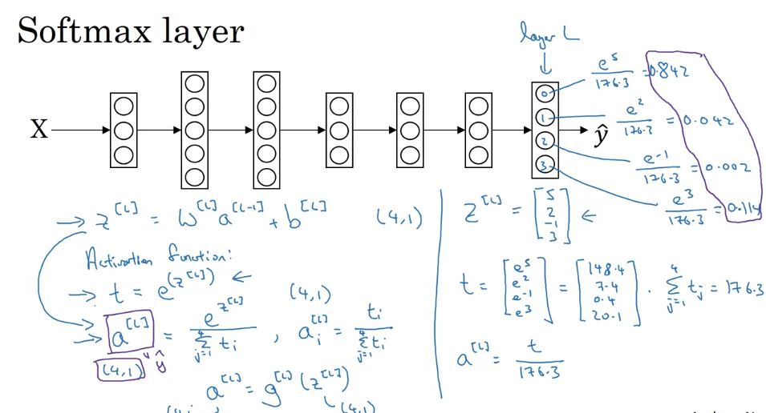
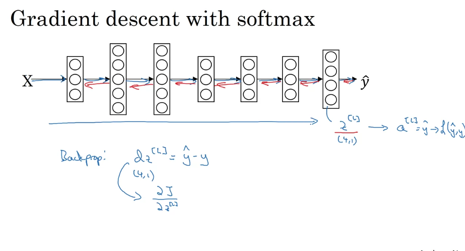

***

# Notes 11-9-23

## Week 3 of Course 2

## Hyperparamter Tuning

* How do we decide the values of **hyperparamters** to test with?

* One method is to search through a **random** distribution of points, in the space defined by the **hyperparameters**.

* For further tuning, you can then zoom in on the region surrounding the best performing points, and further search there.

* This approach is known as **Coarse to Fine**.

* But how do we randomly select the values, and in what range?

* A **logarithmic** scale is preffered to a normal scale for this purpose.

* This ensures that we give as much attention to values between 0.1 and 0.01 as we do to values between 0.001 and 0.0001.

* There's two ways of training models to solve a particular problem.

* One way is to babysit a single model and tweak its hyperparameters manually.

* This way is computationally cheaper.

* The other way is to train a bunch of models simultaneously with different hyperparameters and select the best performing ones.

* This is only done if computational costs are not a concern.

***
## Batch Normalization

* **Batch Normalization** is the process of setting the input data to be centered around zero(mean) and have unit variance.

* This is accomplished by the following formulas:

* This increases the computational efficicency and makes it easier for the weights to learn.

* However, we dont just normalize input data, we also normalise the *Z* computed before the activation step.

* This is done as follows :

* Here, _gamma_ and _beta_ are learning parameters of the model, similar to weights.

* Their purpose is to normalise the hidden states to have some fixed mean and variance, need not be 0 and 1.

* Typically, since we find the mean of _Z_, the presence of _b_ is redundant and thus it can be zero'd out.

* Instead we have _beta_ performing its function.

* Batch Norm is used with gradient descent as follows.

***
## Softmax classifier

* The **Softmax** function allows us to convert a vector of values, into a vector of probabilities, that all add up to unity.

* This is very useful when working with multiple outputs like in the case of classification.

* You can convert the output of your network into a vector of probabilities corresponding to the likelihood of that particular class being the right prediction.

* **Softmax** is implemented in backprop as follows:

