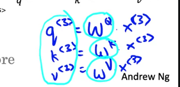
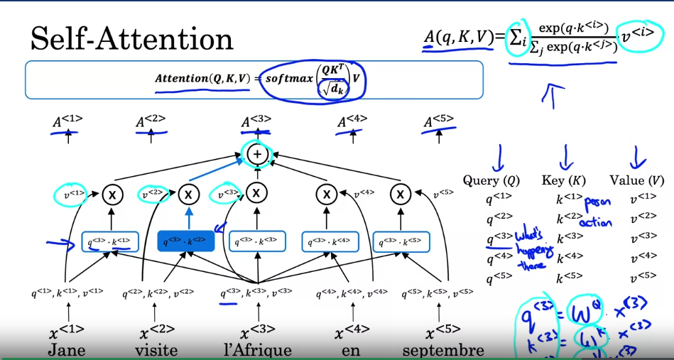
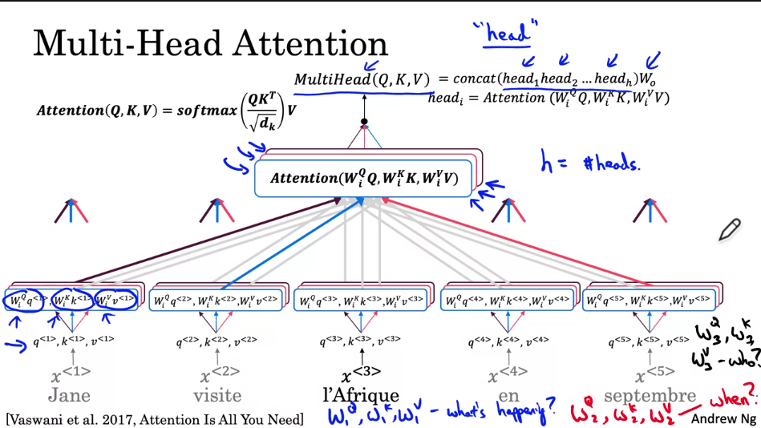
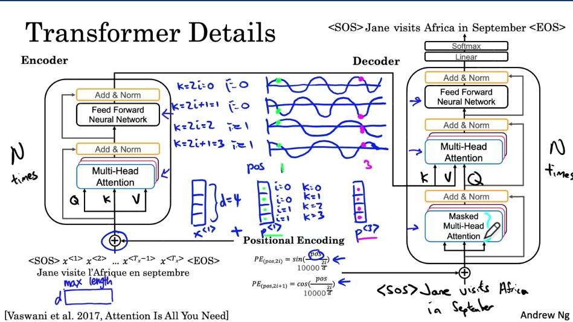

# Notes 23-9-23

## Week 4 of Course 5

## Transformers

#### Transformers using attention perform much better at processing longer sequences as compared to RNNs, LSTMs, etc and are able to correlate earlier parts of the sequeunce to latter parts.

***
### Self - Attention
***

*** Word embeddings** can be altered to add contextual meaning to the words thanks to **self-attention**.

* This is done with the help of **Query**, **Key** and **Value** matrices calculated as shown.

* The attention scores are then computed as follows :

* This allows the **word embeddings** to store richer information about a certain word relevant to the context in which it is used.

* This is done by multiplying the **Query** matrix with the **Key** matrix to find out which context words are most relevant for the current words.

* This **dot product** is then scaled by **sqrt(dk)** to prevent the value from exploding.

* Then we **softmax** this and multiply it by the **Value** matrix and all the products together, so that, the most relevant words see the most of their **Value** matrix in the final **attention score**.

***
### Multi-Headed Attention
***

* **Multi-Headed Attention** is essentially a loop over **Self-Attention**

* Typically we take the **Query**, **Key**, **Value** matrices generated for each word and multiply them by a set of **three weight matrices** for each of the three for each _head_ of the unit.

* Note that each _head_ has its own set of **weights**, but the **query**, **key**, **value** matrices passed to each head initially, are the same.

* In this way, each _head_ of the unit learns to focus on a different part of the **input sentence**.

* For example, if you had a sentence say, "Mark will be going to Sweden in July", each _head_ may focus on a different part, such as the action, the destination, the subject, the date, etc.

* The final **attention** matrix is obtained by **concatenating** the attention generated by each _head_ and multiplying by an **output weight**

***
## Transformer Network

* The block diagram of a **transformer** is shown below : 

* It consists of 2 main components, the **Encoder**, and the **Decoder**.

* The input to both **encoder and decoder** is first added with **positional encodings**, to encode the position of each word and pass that information to the **transformer**.

* **Sine** and **cosine** functions are chosen as they are easy for the network to learn.

* The **encoder** consists of a **multi-head attention layer** that we saw earlier, followed by a **Add and Norm** Layer which works similar to a **residual connection**, ensuring that information like the **positional encoding**, is not lost between layers. It also **batch normalizes** the input to help with faster learning.

* This **Add and Norm** layer is repeated throughout the network.

* Then a **Feed-Forward Network** is used to finally decide which parts of the input sentence are actually relevant.

* Then, the **Key and Value** matrices are passed to the **decoder**.

* The **decoder** works similar to the **encoder** with the exception of a second **multi-head attention** layer.

* The first **multi-head attention** layer is a **masked** layer, in the sense that the **decoder** is not allowed to look at future positions of the output sentence.

* The second **multi-head attention** layer uses the **key**, **value** matrices generated by the **encoder** and matches them against the **query** matrices of the **decoder** input.

* Essentially, it tries to see which of the input words relate to the output words and how.

* Finally after another **Feed-Forward Layer**, the **linear layer and softmax layer** generate the output probabilities, and the most likely output token is then selected and fed back into the **decoder** along with the **entire** output sentence to generate the next output token.

* The **encoder** and **decoder** blocks are stacked multiple times to ensure thorough processing.

* Typically, one initiates the output generation, by feeding a \<SOS> or \<EOS> token to the **decoder**.

