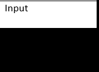
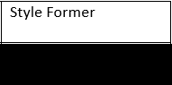

# Text-Style-Transfer

# About the Project

## Results

 

 

## Aim
The aim of this project is to utilise various neural network architectures to modify the style of a sentence while preserving its meaning.

## Description
Text Style Transfer is the modification of style of a sentence without altering the semantic content. This can be done through a variety of different methods. 

Here we have showcased 4 of the methods that we have tried to apply to solve the given problem.

Namely,
1. Transformer-only
2. StyleFormer
3. DeleteRetrieveGenerate
4. CrossAligned

## Tech Stack
The techonologies used in this project include:
1. [Python](https://www.python.org/)
2. [Tensorflow](https://www.tensorflow.org/)
3. [Pytorch](https://pytorch.org/)
4. [GoogleColab](https://colab.google/)

## File Structure
    ├── 3b1b-Linear-Algebra-Notes               # Notes made for linear algebra course
        ├── 
        ├── 
    ├── Coursera-Assignments                    # Coursera Assignments
        ├── Warren-Assignments
        ├── Druhi-Assignments
        ├── Yashvi-Assignments
    ├── Coursera-Notes                          # Notes on Deep Learning
        ├── Warren-Notes
        ├── Druhi-Notes
        ├── Yashvi-Notes
    ├── CrossAligned                            # CrossAligned implementation
        ├── code
        ├── data
        ├── img
        ├── tmp
    ├── DeleteRetrieveGenerate                  # DeleteRetrieve implementation
        ├── data
        ├── src
        ├── tools
        ├── working_dir
    ├── Mini-Projects                           # Mini projects made
        ├── Deep-Neural-Network-From-Scratch
        ├── IMDB-Lstm
        ├── MNISTDigit
    ├── Project-Report                          # Report on the project
        ├──  Project-Report.pdf
    ├── StyleFormer                             # StyleFormer implementation
        ├── data
        ├── evaluator
        ├── models
        ├── outputs
        ├── data.py
        ├── main.py
        ├── train.py
        ├── utils.py
        ├── README.md
    ├── Transformer                             # Transformer implementation
        ├── data
        ├── weights
        ├── Tokenizer.ipynb
        ├── Transformer.ipynb
        ├── README.md
    ├── LICENSE                            
    ├── README.md                          

## Contributors
* **[Druhi Phutane](https://github.com/druhi021204)**

* **[Warren Jacinto](https://github.com/DeadSpheroid)**

* **[Yashvi Gala](https://github.com/Yashvi-Gala09)**

## Future Prospects
* The usage of finetuned LLMs such as GPT, PaLM, to achieve the desired fluency in Text Style Transfer.
* Potentially use Reinforcement Learning as described [here](https://github.com/luofuli/DualRL/)

## Resources and Acknowledgments
* We are gratfeul to [CoC VJTI](https://github.com/CommunityOfCoders) and the [Project X](https://github.com/CommunityOfCoders/Project-X-2023) program.

* Special thanks to our mentor [Labeeb Asari](https://github.com/labeeb-7z) for his experties and guidance throughout the project.

* Additionally, we are also thankful for all the Project X mentors for their inputs and advice on our project.

* Refered the official [tensorflow tutorials](https://www.tensorflow.org/tutorials) for understanding the framework.

* [Andrew Ng's courses on Coursera](https://www.coursera.org/specializations/deep-learning) for an understanding of neural networks.

* [Attention is All You Need](https://arxiv.org/abs/1706.03762) for understanding the Transformer architecture.

* [Style Transformer: Unpaired Text Style Transfer without Disentangled Latent Representation](https://arxiv.org/abs/1905.05621) for the Style Transformer Implementation.

* [Style Transfer from Non-Parallel Text by Cross-Alignment](https://arxiv.org/abs/1705.09655) for the CrossAligned implementation

* [Delete, Retrieve, Generate: A Simple Approach to Sentiment and Style Transfer](https://arxiv.org/pdf/1804.06437.pdf) for the DeleteRetrieve implementation

